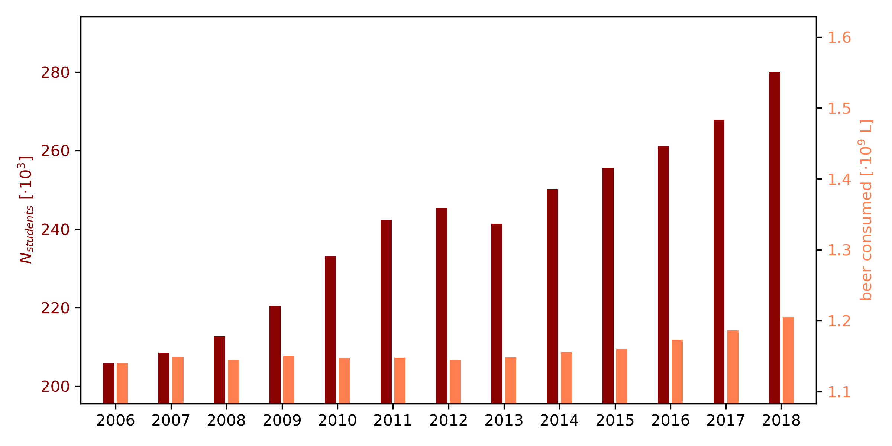

Student number: 13274864 
Paper 1: Fantastic yeasts and where to find them: the hidden diversity of dimorphic fungal pathogens 
Paper 2: An analysis of the forces required to drag sheep over various surfaces 
Paper 3: The neurocognitive effects of alcohol on adolescents and college students 

## Annual beer consumption and student count at the UvA

As can be seen from the plot above, both the amount of students and annual beer consumption have been increasing in the period of 2006 to 2018. However, the relative increase of students is far higher than the relative increase in beer consumptions, such that we can conclude that, on average, students consume less beer throughout the years. Note that, although the range limits on the y-axis are not the same, the relative range sizes are the same.

